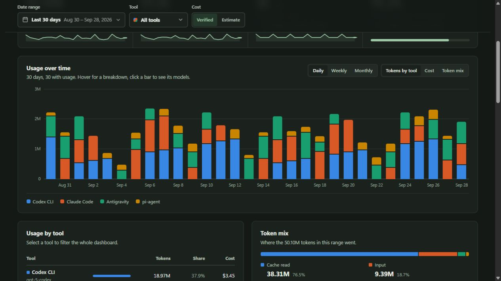
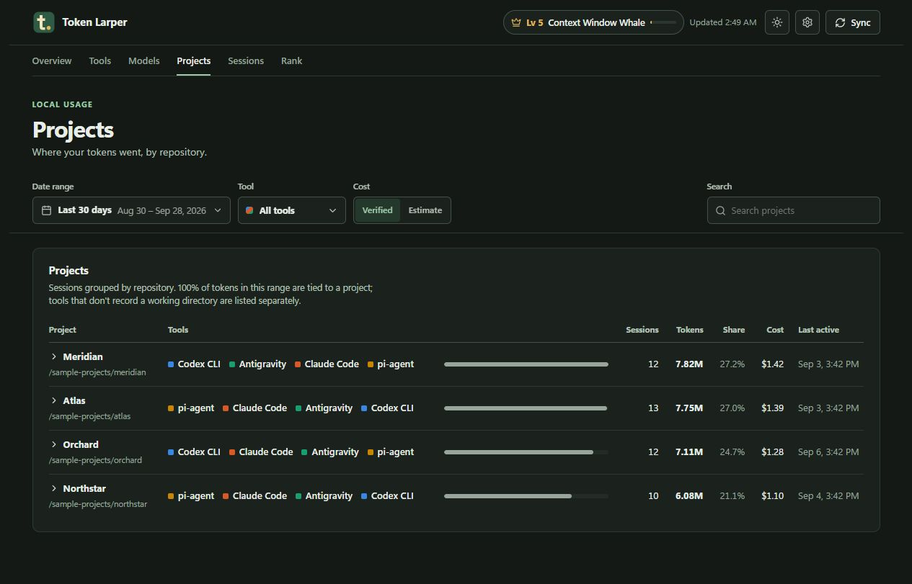
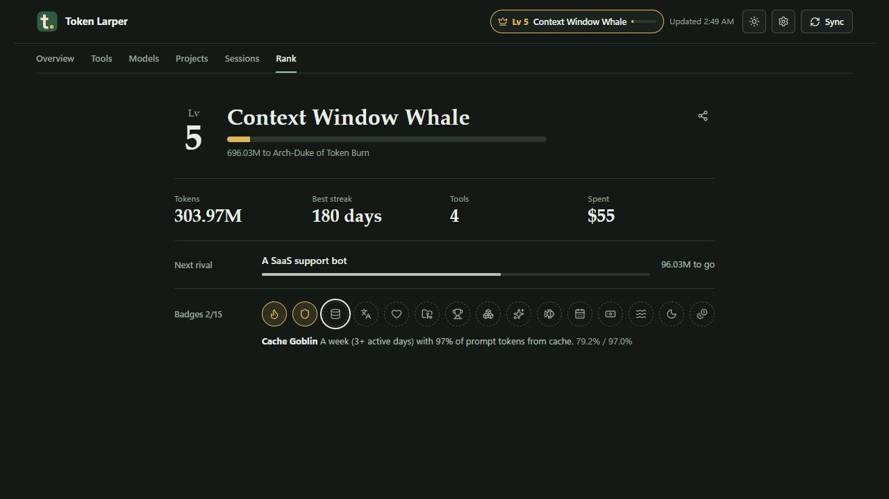
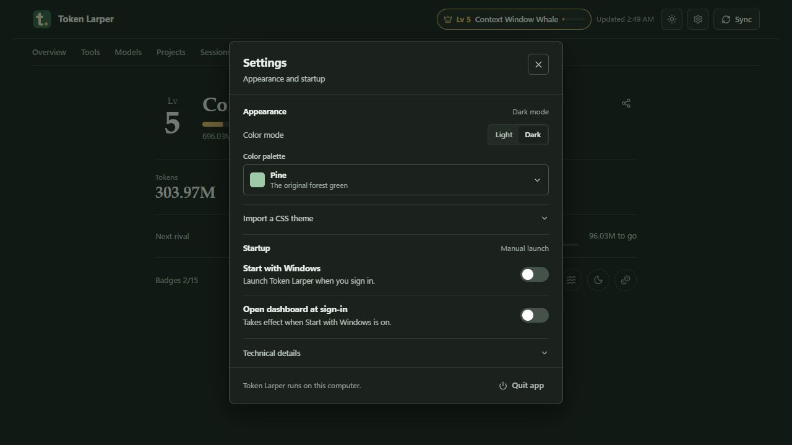

# 🔥 Token Larper

> **Multi-Harness AI Coding Usage & Cost Telemetry Dashboard**  
> Built on top of [`ccusage`](https://github.com/ccusage/ccusage) to aggregate, visualize, and gamify local token burn across 18+ AI coding agents with a native Windows System Tray widget and zero cloud dependencies.

[](https://bun.sh)
[](https://github.com/ccusage/ccusage)
[](https://github.com)
[](https://github.com)
[](LICENSE)

---

## 📖 Overview

> [!NOTE]
> **Built on top of [`ccusage`](https://github.com/ccusage/ccusage)**: Token Larper is built directly on top of the open-source `ccusage` engine by [@ccusage](https://github.com/ccusage). While `ccusage` provides the foundational CLI scraping and cost calculation for local agent logs, Token Larper wraps it into a rich desktop experience—adding an interactive web dashboard, shadcn-style date range calendar, multi-agent project indexing, native Windows System Tray monitoring, and the gamified Hall of Larp.

Token Larper passively reads session files, SQLite databases, and telemetry logs created on your local disk by CLI and IDE coding agents (**Claude Code**, **Codex**, **Antigravity**, **GitHub Copilot CLI**, **OpenCode**, and 13 others). 

It consolidates all sessions into a real-time, interactive local dashboard running on [`http://localhost:4269`](http://localhost:4269) on **Windows, macOS, and Linux**. On Windows, it also lives quietly in your notification area as a lightweight, DPI-aware system tray icon.

* **Powered by `ccusage`**: Uses `ccusage` v20+ for cross-platform log parsing, token counting, and verified frontier model pricing.
* **100% Private & Offline**: No API keys required, no external proxies to configure, and zero analytics or telemetry sent to the cloud. The one outbound request is an optional update check that asks npm for the latest version number; turn it off in **Settings → Updates**.
* **Cross-Platform Core**: The telemetry engine, 18 harness scrapers, and React dashboard run identically across Windows, macOS (Apple Silicon & Intel), and Linux.
* **Gamified Hall of Larp**: Track your lifetime token burn, unlock 14 achievements, climb an 11-tier ranking ladder past rival personas, and export a shareable 1200×630 flex badge.
* **Six Styles, Any Accent**: Grove, Terminal, Paper, Brutal, Soft, and Mono each change fonts, corner radius, spacing, borders, and shadows, not just colors. Pair any of them with a preset or custom accent, or import a tweakcn/shadcn CSS theme on top.
* **Subscription-Aware**: Distinguishes between strict verified API billing and estimated **"LARP Value"** (the theoretical API cost of tokens consumed through flat-rate subscriptions like Claude Pro/Max, Copilot, or Antigravity).

---

## Screenshots and walkthrough

The screens below use sample data. No local sessions or project names are included.

<video src="https://github.com/user-attachments/assets/104c8036-694e-474b-81e1-d33576f2cc30" controls playsinline poster="https://raw.githubusercontent.com/YarooqH/token-larper/main/docs/media/overview.jpg" width="820">
  <a href="docs/media/walkthrough.mp4">Watch the 20-second walkthrough</a>
</video>

| Usage breakdown | Projects |
| --- | --- |
|  |  |

| Hall of Larp | Settings |
| --- | --- |
|  |  |

---

## 📋 Prerequisites

Before setting up Token Larper, ensure your machine meets the following requirements:

### 1. Operating System
Token Larper runs across all major operating systems:
* **Windows 10 / Windows 11** (64-bit x64 or ARM64):
  * Full web dashboard + native Windows System Tray widget (`t.` monogram with live hover stats & boot auto-start).
* **macOS** (12.0+ Monterey or later, Apple Silicon M-series or Intel x64):
  * Full web dashboard + all 18 harness scrapers. Launches via terminal or background daemon (`nohup` / LaunchAgent).
* **Linux** (Ubuntu, Debian, Fedora, Arch, etc., x64 or ARM64):
  * Full web dashboard + all 18 harness scrapers. Launches via terminal or `systemd --user`.

### 2. Bun Runtime (v1.1+)
Token Larper uses **[Bun](https://bun.sh)** for its ultra-fast JavaScript/TypeScript server, bundling, and process management.

To check if Bun is installed:
```bash
bun --version
```

If you do not have Bun installed:
* **macOS & Linux**:
  ```bash
  curl -fsSL https://bun.sh/install | bash
  ```
* **Windows (PowerShell)**:
  ```powershell
  powershell -c "irm bun.sh/install.ps1 | iex"
  ```
*(After installing Bun, restart your terminal so `bun` is available on your `PATH`.)*

### 3. Windows PowerShell 5.1+ (Windows Only)
* Required **only on Windows** to draw the DPI-aware notification area system tray icon.
* **Execution Policy**: If your system restricts PowerShell scripts, enable local execution:
  ```powershell
  Set-ExecutionPolicy -Scope CurrentUser -ExecutionPolicy RemoteSigned
  ```
*(On macOS and Linux, the server detects non-Windows platforms automatically and skips the Windows tray initialization).*

### 4. At Least One Supported AI Coding Harness
You should have at least one AI coding harness installed and used on your machine so there are session logs to index (e.g. `~/.claude/` for Claude Code, `~/.local/share/opencode/` for OpenCode, `~/.gemini/` for Gemini/Antigravity, etc.).

---

## 🚀 Quick Setup & Installation

### Option 1: Instant 1-Line Run (Recommended)
You can run Token Larper instantly without cloning:
```bash
npx token-larper
# or
bunx token-larper
```
It starts in the background, opens the dashboard, and keeps running after you close the terminal. On Windows, quit it from the tray icon. On any platform:
```bash
bunx token-larper stop          # stop it
bunx token-larper --foreground  # run in the terminal with logs instead
bunx token-larper --help        # all options
```
The background server writes its output to `server.log` in the data folder.

---

### Option 2: Clone from Source

#### Step 1: Get the Code
Clone the repository (or click **Code → Download ZIP** on GitHub and extract it):
```bash
git clone https://github.com/YarooqH/token-larper.git
cd token-larper
```

### Step 2: Install Dependencies
Install the required packages using Bun:
```bash
bun install
```

---

## 🏃 Running Token Larper

### On Windows

#### Option A: Silent System Tray (Recommended)
Launches windowless directly into your Windows System Tray without keeping a command prompt open:
```powershell
bun run tray
```
> **Shortcut**: You can also simply **double-click** `Start-TokenLarper.vbs` in File Explorer!

* The **Burning t.** icon will appear in your notification tray.
* Hover over the icon to see your real-time token count and cost estimate.
* Left-click the icon for a compact usage popup with an **Open dashboard** button. Right-click it to sync or configure boot auto-start.

#### Option B: Terminal Mode (Logs & Development)
```powershell
bun start          # Standard terminal launch
bun run dev        # Live reload on changes
```

---

### On macOS & Linux

#### Option A: Background Daemon
Run the server detached in the background:
```bash
nohup bun start > /dev/null 2>&1 &
```

#### Option B: Foreground Terminal Mode
```bash
bun start          # Standard launch
bun run dev        # Live reload on changes
```

---

### Opening the Dashboard
Open your browser and navigate to:
👉 **[http://localhost:4269](http://localhost:4269)**

*(On Windows, left-click the **`t.`** tray icon and select **Open dashboard**, or choose **Open Dashboard** from its right-click menu.)*

---

### Stopping Token Larper
To cleanly stop the server:
* **From the CLI (All Platforms)**:
  ```bash
  bun run stop
  ```
  *(Sends a graceful shutdown request to the local API on port 4269).*
* **From the Windows Tray**: Right-click the **`t.`** icon → Select **Quit Token Larper**.

---

## 🛠️ Supported Harnesses (18 Agents)

Token Larper utilizes `ccusage` v20+ paired with native deep scanners to automatically detect and index session history across 18 coding environments:

| Harness | Vendor | Default Local Path Scanned |
| :--- | :--- | :--- |
| **Claude Code** | Anthropic | `~/.claude/` & `~/.claude.json` |
| **Antigravity** | Google DeepMind | `%APPDATA%\antigravity-ide\` & `~/.gemini/` |
| **Codex CLI** | OpenAI | `~/.codex/` |
| **GitHub Copilot CLI** | GitHub / Microsoft | `~/.copilot-cli/` & `%LOCALAPPDATA%\GitHubCopilot` |
| **Gemini CLI** | Google | `~/.gemini/` |
| **OpenCode** | OpenCode | `~/.local/share/opencode/` & `%APPDATA%\opencode` |
| **pi-agent** | Pi | `~/.pi/` & `~/.pi-agent/` |
| **Goose** | Block | `~/.goose/` |
| **Hermes** | Hermes AI | `~/.hermes/` |
| **Amp** | Ampersand | `~/.amp/` |
| **Droid** | Factory | `~/.droid/` |
| **Codebuff** | Codebuff | `~/.codebuff/` |
| **Kilo** | Kilo | `~/.kilo/` |
| **Kimi** | Moonshot | `~/.kimi/` |
| **Qwen** | Alibaba | `~/.qwen/` |
| **OpenClaw** | OpenClaw | `~/.openclaw/` |
| **Grok** | xAI | `~/.grok/` |
| **ZCode** | ZCode | `~/.zcode/` |

---

## ⚙️ Configuration & Features

### Auto-Start on Windows Boot
You can have Token Larper launch silently into the system tray every time you turn on your computer:
1. Right-click the **`t.`** system tray icon.
2. Click **Start on Windows Boot** to enable it.
3. *(Optional)* Click **Auto-Open Browser on Boot** if you want your default browser to launch directly to the dashboard upon login.

*(This registers a clean user entry under `HKCU\Software\Microsoft\Windows\CurrentVersion\Run\TokenLarper` running the windowless launcher).*

### Custom Port
By default, Token Larper runs on port `4269`. You can specify a custom port:
* **macOS & Linux**:
  ```bash
  PORT=5000 bun start
  ```
* **Windows (PowerShell)**:
  ```powershell
  $env:PORT = "5000"; bun start
  ```
The port is also persisted in `settings.json` in the data folder (see below).

### Data Folder
Caches and settings live outside the app folder, so updates keep them:

* **Windows**: `%LOCALAPPDATA%\TokenLarper`
* **macOS**: `~/Library/Application Support/TokenLarper`
* **Linux**: `$XDG_DATA_HOME/token-larper` (default `~/.local/share/token-larper`)

Set `TOKEN_LARPER_DATA_DIR` to use another folder. Versions before 1.5.0 kept this data in `.cache` inside the app; it is copied over on first run.

### Updates
When a new version is on npm, the dashboard shows a banner. **Update now** starts `bunx token-larper@latest` in the background; the new version replaces the running one on the same port and the dashboard reloads. You can also check from **Settings → Updates**, or turn automatic checks off there. A copy cloned from git updates with `git pull`.

### Headless Server Mode
If running on a remote headless server or Docker container, you can explicitly disable the tray icon (automatically disabled on macOS/Linux):
```bash
NO_TRAY=1 bun start
```

---

## ⚖️ Comparison with Alternatives

| Dimension / Feature | Token Larper | LiteLLM / Portkey | Langfuse / Arize | `ccusage` CLI |
| :--- | :---: | :---: | :---: | :---: |
| **Telemetry Ingestion** | Passive local disk log scraping | HTTP Reverse Proxy | SDK / OTel Collector | Passive local disk log scraping |
| **Setup Complexity** | Zero-config (`npx token-larper`) | High (custom proxy URLs) | High (SDK instrumenting) | Low (`npm i -g ccusage`) |
| **Supports Flat Subscriptions (Pro/Max)** | ✅ Yes (Estimates LARP value) | ❌ No | ❌ No | ✅ Yes |
| **User Interface** | Interactive Web + Native Tray | Cloud / Docker Web UI | Cloud / Self-hosted UI | Terminal tables only |
| **Agent Auto-Detection** | ✅ 18+ coding harnesses | ❌ Manual per-tool proxy setup | ❌ Manual code changes | ✅ 18+ coding harnesses |
| **100% Offline & Private** | ✅ Yes (Zero cloud telemetry) | ⚠️ Depends on deployment | ⚠️ Cloud or self-hosted DB | ✅ Yes |
| **Gamification & Shareable Cards** | ✅ Yes (Hall of Larp) | ❌ No | ❌ No | ❌ No |

---

## 🏆 Hall of Larp (Rank & Gamification)

Token Larper includes a dedicated **Rank** view designed to celebrate your token burn:
* **11 Lifetime Tiers**: Progress from *Script Larper* (0 tokens) to *Deity of the Infinite Context Window* (1B+ tokens).
* **Rival Leaderboards**: Compete against quirky procedural AI rivals as your token count climbs.
* **14 Achievements**: Unlock badges for late-night hacking sessions, burning $100+ in a single day, or harnessing 5+ different agents.
* **Shareable Rank Card**: Generate and export a 1200×630 PNG badge to share on X/Twitter or Discord. Project paths and names are strictly sanitized and never included.

---

## ❓ Troubleshooting & FAQ

### 1. How do I monitor Claude Code token usage and spend locally?
Token Larper automatically scans `~/.claude/` for Claude Code session files and SQLite databases. It displays daily, weekly, and monthly token burns (input, output, cache creation, cache read) alongside verified costs without requiring Anthropic API keys.

### 2. Can I track tokens across multiple tools like Antigravity, Claude Code, and Codex in one place?
Yes. Token Larper detects and aggregates usage across 18 supported coding harnesses simultaneously, allowing you to see your cross-agent total spend and filter by specific tools.

### 3. Why track local agent logs instead of using a reverse proxy like LiteLLM?
Many modern coding agents (Claude Code, GitHub Copilot CLI, Antigravity) use OAuth subscriptions rather than raw pay-per-token API keys. Proxies cannot intercept or track these subscription agents without TLS decryption and custom protocol reverse-engineering. Token Larper solves this by reading the session logs the agents write directly to your local drive.

### 4. `'bun' is not recognized as an internal or external command`
* **Cause**: Bun was installed, but the current terminal session doesn't have `%USERPROFILE%\.bun\bin` in its `PATH`.
* **Fix**: Close and reopen your terminal, or manually add it for your session:
  ```powershell
  $env:PATH += ";$env:USERPROFILE\.bun\bin"
  ```

### 5. `cannot be loaded because running scripts is disabled on this system`
* **Cause**: Windows PowerShell default execution policy is preventing local scripts from running.
* **Fix**: Open PowerShell as your standard user and run:
  ```powershell
  Set-ExecutionPolicy -Scope CurrentUser -ExecutionPolicy RemoteSigned
  ```

### 6. The system tray icon is not visible
* **Cause**: Windows may have placed the icon inside the "hidden notification icons" overflow menu (the `^` arrow on the taskbar).
* **Fix**: Click the `^` arrow next to your Windows clock, find the green **`t.`** icon, and drag it onto your main taskbar to keep it permanently visible.

### 7. No tokens or sessions are showing up in the dashboard
* **Cause**: Either no coding agents have been executed yet, or their logs are located in non-standard directories.
* **Fix**: 
  1. Run a quick session with one of your tools (e.g., `claude` or `antigravity`).
  2. Right-click the system tray icon and click **Sync Harnesses Now (ccusage)**, or click the **Sync Now** button in the top right of the dashboard.

### 8. Port 4269 is already in use
* **Fix**: Token Larper might already be running in the background. Stop it using:
  ```powershell
  bun run stop
  ```
  Or change the port:
  ```powershell
  $env:PORT = "4500"
  bun start
  ```

---

## 📂 Project Architecture

```
tokenlarper/
├── Start-TokenLarper.vbs      # Windowless silent launcher for Windows
├── package.json              # Scripts & dependencies
├── scripts/
│   ├── run-server.ps1        # PowerShell background watchdog & port resolver
│   ├── launch-silent.vbs     # VBS helper for boot auto-start
│   ├── tray-host.ps1         # Native DPI-aware Windows Forms system tray host
│   └── launch-on-default-desktop.ps1 # WinSta0\Default desktop trampoline
├── src/
│   ├── server.ts             # Bun HTTP & WebSocket server + client bundler
│   ├── ccusage.ts            # 18-harness telemetry reader & cost calculation engine
│   ├── tray.ts               # System tray lifecycle management & IPC
│   ├── startup.ts            # Windows registry boot integration
│   ├── projects.ts           # Workspace & Git repository deduplication
│   ├── types.ts              # TypeScript interfaces & data contracts
│   └── client/               # React 19 Frontend Dashboard
│       ├── App.tsx           # Layout, navigation, date ranges, and global state
│       ├── charts.tsx        # Stacked SVG bar & trend charts
│       ├── views/            # Overview, Tools, Models, Sessions, Projects, Rank
│       └── styles.css        # Custom responsive CSS design system (Dark/Light)
```

---

## 🙏 Acknowledgments & Credits

Token Larper is built directly on top of the work of the open-source community:
* **[`ccusage`](https://github.com/ccusage/ccusage)** — The core telemetry engine powering local session scraping, token counting, and cost calculations across AI coding harnesses.
* **[Bun](https://bun.sh)** — Fast all-in-one JavaScript runtime and bundler.
* **[Lucide Icons](https://lucide.dev)** — Clean and consistent iconography for the web dashboard.

---

## 📄 License

MIT © Token Larper Contributors
